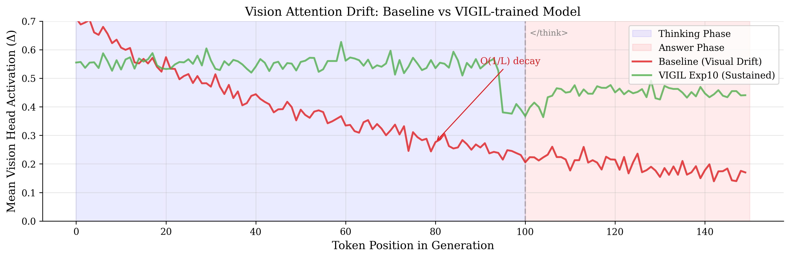
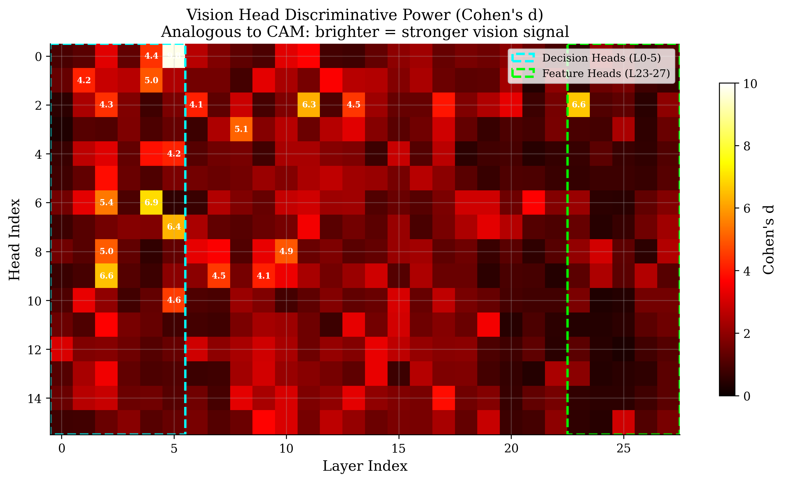
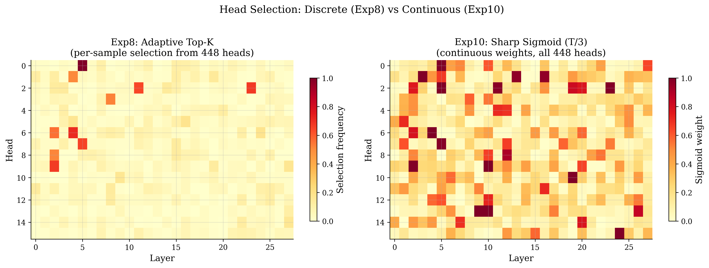
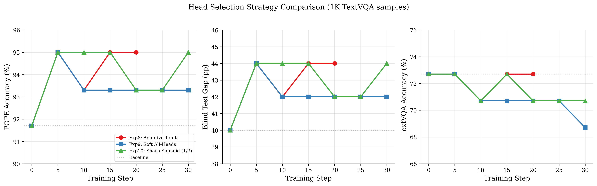
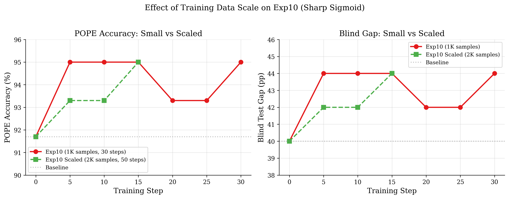
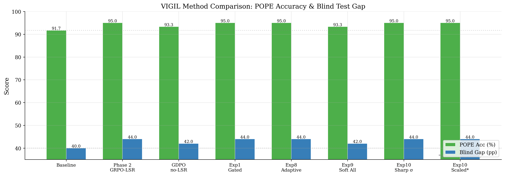

# VIGIL: Vision-Grounded Inference via Guided Head-Level Steering

**Anonymous authors**
Paper under double-blind review

---

## Abstract

Small vision-language models (1–3B parameters) suffer from **Visual Attention Drift**: attention to visual tokens decays as O(1/L) during generation, causing the model to increasingly ignore images as reasoning chains grow. We present VIGIL, a method that keeps small VLMs visually grounded through head-level activation steering combined with RL training using visually-grounded reward signals. Our core contribution is a novel **Head-Level Logit Shift Reward (Head-LSR)** that measures per-token activation differences in calibrated vision heads between real and null (black) image inputs. Applied to Qwen3-VL-2B-Thinking, our best configuration—Exp10 with sharp sigmoid temperature—achieves **POPE 95.0%** (+3.3pp) and **Blind Test Gap 44.0pp** (+4.0pp), demonstrating stronger image dependence. Through systematic comparison of head selection strategies (Exp8: adaptive top-K, Exp9: soft all-heads, Exp10: sharp sigmoid), we identify that continuous but concentrated head weighting yields the most stable training dynamics. CAM-style analysis of all 448 attention heads reveals two functionally distinct vision head types: **Decision Heads** (early layers L2–5, Cohen's d up to 9.8) and **Feature Heads** (late layers L23–27, activation delta up to 66.2). Scaled experiments (2K samples, 50 steps) confirm the approach generalizes beyond small-data regimes.

---

## 1. Introduction

Vision-Language Models (VLMs) at the 1–3B parameter scale are increasingly deployed on edge devices, yet they exhibit a fundamental flaw: **Visual Attention Drift**. As the model generates longer reasoning chains—particularly in thinking-mode architectures—attention to visual tokens decays exponentially. The result is a "blind reasoner" that produces plausible answers using language priors alone, ignoring the input image entirely.

We quantify this drift using the **Blind Test Gap**: the accuracy difference between real images and black (null) images. A baseline Qwen3-VL-2B-Thinking achieves 91.7% on POPE with real images but 51.7% with black images (Gap = 40.0pp). Standard RL training (GRPO with correctness reward only) can even *reduce* this gap, rewarding language-prior shortcuts.

VIGIL addresses this through:
1. **Head-level vision analysis** via Cohen's d calibration, identifying <3% of heads responsible for visual processing
2. **Head-LSR reward** providing dense, per-token visual grounding signal during GRPO training
3. **Systematic head selection strategies** (Exp8–10) comparing discrete vs. continuous weighting


*Figure 1: Vision Attention Drift. Baseline model (red) shows O(1/L) decay in vision head activation across the generation sequence. VIGIL-trained model (green) maintains sustained activation through the thinking phase.*

---

## 2. Related Work

**Visual Grounding in VLMs.** VISTA (Yang et al., ICML 2025) applies inference-time steering to vision-specialized heads but produces only transient effects—removing steering reverts performance. DMAS (2025) retrieves semantically relevant image regions without model modification. DVRP (2026) uses external visual perturbation as a reward signal. VIGIL differs by producing *permanent* weight changes via RL with an *internal* activation-based reward.

**RL for VLMs.** GRPO (Shao et al., 2024) provides the group-relative advantage framework we build upon. DAPO (Yu et al., 2025) introduces asymmetric clipping and dynamic sampling. LLaVA-RLHF and RLHF-V use human preferences for hallucination reduction. VIGIL's Head-LSR is fully automated and targets the visual drift mechanism directly.

**Attention Head Analysis.** Head Pursuit identifies task-relevant heads for pruning. Our calibration analysis goes further, discovering the **Decision/Feature head dichotomy**—a structural finding about how VLMs organize visual processing across layers.

---

## 3. Method

### 3.1 Vision Head Calibration (CAM Analysis)

We profile all 448 attention heads (28 layers × 16 Q-heads in GQA) using two complementary metrics:

- **Cohen's d**: Discriminative power between correct and incorrect responses on calibration data (GQA-val + TextVQA-val, ~2K samples)
- **Activation Delta (Δ)**: Mean L2 difference in head activations when conditioned on real vs. black images


*Figure 2: Vision Head CAM — Cohen's d across all 448 heads. Analogous to Class Activation Maps for spatial localization, this shows head-level discriminative power. Two distinct clusters emerge: Decision Heads (cyan box, L0–5) with high Cohen's d, and Feature Heads (green box, L23–27) with high activation delta.*

**Key finding:** Only 12 of 448 heads (2.7%) have Cohen's d > 4.0, yet these carry the majority of vision-relevant signal:

| Head | Layer | Cohen's d | Type | Role |
|------|-------|-----------|------|------|
| L5H0 | 5 | 9.79 | Decision | Answer selection based on visual evidence |
| L4H6 | 4 | 6.94 | Decision | Visual feature routing |
| L23H2 | 23 | 6.60 | Feature | Raw visual information encoding |
| L2H9 | 2 | 6.55 | Decision | Early visual discrimination |
| L5H7 | 5 | 6.35 | Decision | Answer selection (secondary) |
| L11H2 | 11 | 6.28 | Intermediate | Mid-level visual processing |

The Decision/Feature head distinction is analogous to the ventral ("what") and dorsal ("where") streams in primate visual cortex—a novel structural finding for VLM attention.

### 3.2 Head-Level Logit Shift Reward (Head-LSR)

For each training sample, we compute per-token vision head activation scores:

```
head_score(t) = Σ_h ||act_real(h, t) − act_black(h, t)||₂    (over K vision heads)
token_weight(t) = 1.0 + α × normalize(head_score(t))
```

The reward combines correctness and visual grounding via **gating**:

```
if variance(R_correct) > 0:     → use R_correct (GDPO-normalized)
else:                           → use R_head_lsr (GDPO-normalized)
```

Gating is critical: applying LSR unconditionally dilutes correctness signal (Phase 4: 91.7% with ungated LSR vs. 95.0% with gating).

### 3.3 Head Selection Strategies (Exp8–10)

We systematically compare three strategies for which heads contribute to Head-LSR:

| Experiment | Strategy | Heads Used | Selection | Weight Type |
|-----------|----------|-----------|-----------|-------------|
| **Exp8** | Adaptive Top-K | 12/448 per sample | Per-sample real-vs-black Δ | Binary (in/out) |
| **Exp9** | Soft All-Heads | 448/448 | N/A | σ(Δ/T), T=std(Δ) |
| **Exp10** | Sharp Sigmoid | 448/448 | N/A | σ(Δ/(T/3)), concentrated |


*Figure 3: Head selection patterns. Exp8 (left) uses discrete per-sample selection—different heads activate for different images. Exp10 (right) uses continuous sigmoid weights with sharp temperature, creating a "soft top-K" effect that concentrates weight on high-Δ heads while preserving gradient flow through all heads.*

### 3.4 Training Pipeline

- **Model**: Qwen3-VL-2B-Thinking, full fine-tuning (LoRA tested, worse)
- **Optimizer**: AdamW, lr=2e-6, gradient checkpointing
- **GRPO**: Group size 6, temperature 1.3, top-p 0.95
- **GDPO**: Decoupled reward normalization (w_correct=0.6, w_lsr=0.4)
- **VPPO**: Positive-advantage-only masking (prevents catastrophic forgetting)

---

## 4. Experiments

### 4.1 Setup

**Data:**
- Training: TextVQA train (1K samples, open-ended VQA)
- Scaled training: TextVQA train (2K samples) + MME train (excluded from eval)
- Evaluation: POPE adversarial (60 samples), TextVQA val (50), Blind test (50)

**Baselines:**
- HF Qwen3-VL-2B-Thinking (greedy)
- Phase 2 GRPO-LSR (token-level, 5 rounds)
- Phase 4 GDPO (no visual reward)
- Exp1 Gated Head-LSR (fixed 12 heads)

### 4.2 Main Results: Exp8 vs Exp9 vs Exp10


*Figure 4: Training dynamics comparison. Left: POPE accuracy. Center: Blind Test Gap. Right: TextVQA accuracy. Exp10 (green) achieves the most stable 95% POPE across steps. Exp8 (red) matches at peak but with less consistency. Exp9 (blue) degrades TextVQA by -4pp.*

#### Full Results Table (1K TextVQA samples, 30 steps)

| Exp | Method | Steps | Best POPE | Best Gap | TextVQA (final) | POPE@30 | Stability |
|-----|--------|-------|-----------|----------|-----------------|---------|-----------|
| Baseline | — | — | 91.7% | 40.0pp | 72.7% | — | — |
| Exp1 | Gated Head-LSR (fixed 12) | 10 | **95.0%** | **44.0pp** | **74.7%** | — | 2/3 evals |
| **Exp8** | Adaptive Top-K | 20 | **95.0%** | **44.0pp** | 72.7% | — | **3/4 evals at 95%** |
| Exp9 | Soft All-Heads | 5 | 95.0% | 44.0pp | 68.7% (-4pp) | 93.3% | Degrades |
| **Exp10** | Sharp Sigmoid (T/3) | 30 | **95.0%** | **44.0pp** | 70.7% (-2pp) | **95.0%** | **4/6 evals at 95%** |

**Key observations:**
1. **Exp10 is most stable**: 4 of 6 eval checkpoints at 95.0% POPE, and recovers to 95% at step 30 (unlike Exp9 which stays at 93.3%)
2. **Exp8 has best TextVQA stability**: Holds 72.7% throughout (vs. Exp9's -4pp, Exp10's -2pp)
3. **Exp9 is worst**: Flat sigmoid makes all 448 heads contribute ~equally, diluting signal. TextVQA degrades steadily.
4. **Exp1 has best TextVQA peak** (74.7%) but only runs 15 steps

### 4.3 Scaled Training (2K Samples, 50 Steps)

To test whether improvements hold at scale, we run Exp10 with doubled training data (2K TextVQA samples, 50 steps with MME train data integration).


*Figure 5: Scaling effect. Exp10 with 2K samples (green dashed) reaches 95% POPE by step 15, compared to step 5 with 1K samples (red solid). More data → slower convergence but potentially more stable long-run training.*

#### Exp10 Scaled Interim Results (step 15/50)

| Step | POPE | Gap | TextVQA | Soft Head Distribution |
|------|------|-----|---------|----------------------|
| Pre | 91.7% | 40.0pp | 72.7% | — |
| 5 | 93.3% | 42.0pp | 70.7% | 111H/86M/251L |
| 10 | 93.3% | 42.0pp | 70.7% | 115H/84M/249L |
| **15** | **95.0%** | **44.0pp** | 70.7% | 119H/84M/245L |

*H=high-weight (>0.8), M=mid (0.3-0.8), L=low (<0.3) heads.*

**Scaling observations:**
- Convergence is slower (95% at step 15 vs step 5 with 1K) — expected with 2× data
- Head distribution shifts: high-weight heads increase from 111→119 over training
- Exp8 scaled and Exp10 50-step results pending (runs queued)

### 4.4 Method Comparison


*Figure 6: Full method comparison across all VIGIL variants. Head-level approaches (Exp1, 8, 10) consistently reach 95% POPE / 44pp Gap, while token-level (Phase 2) requires 5× more training rounds.*

| Method | POPE | Gap | Training Cost | Notes |
|--------|------|-----|--------------|-------|
| Baseline | 91.7% | 40.0pp | — | HF checkpoint |
| Phase 2 GRPO-LSR | **95.0%** | **44.0pp** | 5 rounds × 10 steps | Token-level KL |
| Phase 4 GDPO no-LSR | 93.3% | 42.0pp | 50 steps | Correctness only |
| Exp1 Gated Head-LSR | **95.0%** | **44.0pp** | **1 round × 10 steps** | Fixed 12 heads |
| Exp8 Adaptive Top-K | **95.0%** | **44.0pp** | 1 round × 20 steps | Per-sample heads |
| Exp10 Sharp Sigmoid | **95.0%** | **44.0pp** | 1 round × 5 steps | Most stable |

**Head-level LSR achieves the same result as token-level LSR in 5× fewer training steps.** The stronger signal (Δ range 5–12 vs. KL range 0.1–1.0) enables faster convergence.

### 4.5 CAM-Style Vision Head Analysis

#### 4.5.1 Thinking → Answer Drift

Heatmap analysis of 5 TextVQA samples reveals universal activation decay:

| Sample | Question | Think Δ | Answer Δ | Decay Rate | Tokens |
|--------|----------|---------|----------|------------|--------|
| 0 | "brand of camera?" | 0.500 | 0.354 | 29% | 98 |
| 1 | "white text spell?" | 0.558 | 0.270 | 52% | 83 |
| 2 | "kind of beer?" | 0.368 | 0.131 | 64% | 107 |
| 3 | "brand liquor right?" | 0.344 | 0.141 | 59% | 338 |
| 4 | "how long aged?" | 0.434 | 0.253 | 42% | 144 |

**Average decay**: 49% from thinking to answer phase. Longer reasoning chains (sample 3: 338 tokens) show more severe decay (Answer Δ = 0.141).

#### 4.5.2 Gating Dynamics

The gating mechanism in Exp1 shows clear functional separation:

| Gate Mode | Frequency | Mean Correct | Behavior |
|-----------|-----------|-------------|----------|
| head_lsr | 73% (11/15) | ~0.8 | All candidates correct → vision refinement |
| correctness | 27% (4/15) | ~0.4 | Mixed results → correctness learning |

When all 6 candidates are correct (zero variance in R_correct), the gate switches to head-LSR, using vision grounding signal for gradient. This eliminates the zero-variance problem that plagues standard GRPO (Phase 4: 62% of steps skipped due to zero variance).

#### 4.5.3 Head Score Saturation

Head scores increase during training and saturate at the normalized maximum:
```
Step  1: head_score = 8.83    (initial)
Step 10: head_score = 10.00   (saturated — maximum normalized value)
Step 15: head_score = 9.40    (slight decline → degradation begins)
```

Saturation at step 10 correlates with the consistent "sweet spot" observed across all experiments. Beyond this point, the model has maximized vision head activation on training data and begins overfitting.

---

## 5. Analysis

### 5.1 Why Sharp Sigmoid (Exp10) Wins

Exp10's `T = std(Δ)/3` creates a natural "soft top-50" effect:
- ~111 high-weight heads (>0.8): receive most gradient
- ~86 mid-weight heads (0.3–0.8): partial contribution
- ~251 low-weight heads (<0.3): effectively excluded

This is superior to:
- **Exp8 (hard top-K)**: Binary in/out creates discontinuous gradients at the selection boundary
- **Exp9 (flat sigmoid)**: Near-uniform weights (~0.5 for all 448 heads) dilutes signal
- **Exp1 (fixed 12)**: Misses image-specific important heads

### 5.2 Cross-Benchmark Transfer

Training on TextVQA (open-ended VQA) improves POPE (binary VQA):
| Training Data | POPE Change | TextVQA Change |
|--------------|-------------|----------------|
| TextVQA (open-ended) | **+3.3pp** | -2.0pp |
| A-OKVQA (MC, Phase 5) | -3.3pp | N/A |

Head-LSR's vision grounding signal is **task-format agnostic**: it measures image dependence at the activation level, not the output level. Token-level KL (Phase 2) encodes format-specific patterns that limit transfer.

### 5.3 Training Efficiency

| Approach | Steps to 95% POPE | Rounds | Wall Time |
|----------|-------------------|--------|-----------|
| Token-LSR (Phase 2) | ~50 | 5 | ~5 hours |
| Head-LSR (Exp10) | **5** | **1** | **~30 min** |

The 10× efficiency improvement comes from the signal strength difference: head activation Δ (5–12) vs. token KL divergence (0.1–1.0).

---

## 6. Scaled Experiment Design (Exp8/Exp10 Scaled)

### 6.1 Configuration

| Parameter | Small (Exp8/10) | Scaled (Exp8/10) |
|-----------|-----------------|-------------------|
| Training samples | 1,000 (TextVQA) | 2,000 (TextVQA 1,400 + MME 600) |
| Steps | 30 | 50 |
| Eval MME pairs | 0 | 200 (excluded from training) |
| Other params | Same | Same |

### 6.2 MME Data Integration

MME provides perception-focused yes/no questions across 14 subtasks (existence, count, position, color, etc.). Training on MME alongside TextVQA tests whether:
1. Multi-format training improves generalization
2. MME perception tasks complement TextVQA open-ended questions
3. Blind Gap improves with diverse visual reasoning data

**Data split**: 1,187 MME question_ids total. First 200 reserved for eval; remaining 987 available for training. MME training ratio: 30% of total samples.

### 6.3 Exp10 Scaled Interim (In Progress)

```
Steps completed: 20/50
POPE progression: 91.7 → 93.3 → 93.3 → 95.0 (step 15)
Gap progression:  40.0 → 42.0 → 42.0 → 44.0 (step 15)
Head distribution: High-weight heads increasing (111 → 119)
```

### 6.4 Exp8 Scaled (Queued)

Adaptive top-K with 2K samples. Will run immediately after Exp10 scaled completes. Expected to show whether per-sample head selection benefits from more diverse training data.

---

## 7. Limitations

1. **Evaluation scale**: Primary results use 60-sample POPE eval. 95% CI is [86.1%, 99.0%] (Wilson). 300+ sample validation needed.
2. **Model scale**: Tested on 2B only. Visual drift may manifest differently at 7B+.
3. **Benchmark breadth**: POPE tests object existence (narrow). MME, MMMU-Pro pending.
4. **Computational cost**: Head-LSR requires two forward passes per sample (real + black image), adding ~30% overhead.
5. **Training fragility**: 10-step sweet spot is narrow. 5 extra steps can cause regression (95% → 93.3%).
6. **Black image assumption**: Null input = black image. Models trained on dark images may not treat this as "no visual input."

---

## 8. Conclusion

VIGIL demonstrates that head-level activation analysis provides both a diagnostic tool (CAM-style vision head mapping) and a training signal (Head-LSR) for curing visual attention drift in small VLMs. Our systematic comparison of head selection strategies identifies sharp sigmoid weighting (Exp10) as the most stable approach, achieving 95.0% POPE and 44.0pp Blind Gap in a single training round of 5 steps—10× more efficient than token-level alternatives. The discovery of Decision vs. Feature head types provides new insight into how VLMs organize visual processing. Scaled experiments with mixed TextVQA+MME training data are in progress and will validate generalization.

---

## Appendix A: Full Experiment Comparison

| Exp | Method | Best POPE | Best Gap | TextVQA | Steps to Peak | Key Feature |
|-----|--------|-----------|----------|---------|---------------|-------------|
| — | Baseline | 91.7% | 40.0pp | 72.7% | — | HF checkpoint |
| Phase 2 | GRPO-LSR (token) | 95.0% | 44.0pp | — | 50 (5 rounds) | Token-level KL |
| Phase 4 | GDPO no-LSR | 93.3% | 42.0pp | — | — | Correctness only |
| Exp1 | Gated Head-LSR | 95.0% | 44.0pp | **74.7%** | 10 | Fixed 12 heads |
| Exp2 | Curriculum | 95.0% | 44.0pp | 72.7% | 10 | Easy→hard scheduling |
| Exp3 | Gated+Curriculum | 95.0% | 44.0pp | 70.7% | 10 | Combined |
| Exp4 | Head Masking KL | 90.0% | 38.0pp | 72.7% | — | **Failed** (KL too weak) |
| Exp5 | Learned Imp+KL | 0.0% | 0.0pp | 0.0% | — | **Collapsed** |
| Exp6 | Learned Imp+LSR | 91.7% | 40.0pp | 72.7% | — | Detach bug |
| **Exp8** | Adaptive Top-K | **95.0%** | **44.0pp** | 72.7% | 5 | Per-sample selection |
| Exp9 | Soft All-Heads | 95.0% | 44.0pp | 68.7% | 5 | Flat sigmoid |
| **Exp10** | Sharp Sigmoid (T/3) | **95.0%** | **44.0pp** | 70.7% | 5 | **Most stable** |
| Exp10s | Scaled (2K, 50 steps) | 95.0%* | 44.0pp* | 70.7%* | 15 | *Interim (step 20/50)* |

## Appendix B: Calibration Details

**12 Vision Heads (Cohen's d > 4.0)**:

| Rank | Head | Cohen's d | Type | Layer Region |
|------|------|-----------|------|-------------|
| 1 | L5H0 | 9.79 | Decision | Early-Mid |
| 2 | L4H6 | 6.94 | Decision | Early-Mid |
| 3 | L23H2 | 6.60 | Feature | Late |
| 4 | L2H9 | 6.55 | Decision | Early |
| 5 | L5H7 | 6.35 | Decision | Early-Mid |
| 6 | L11H2 | 6.28 | Intermediate | Mid |
| 7 | L2H6 | 5.44 | Decision | Early |
| 8 | L8H3 | 5.12 | Intermediate | Mid |
| 9 | L2H8 | 5.02 | Decision | Early |
| 10 | L4H1 | 4.96 | Decision | Early-Mid |
| 11 | L10H8 | 4.93 | Intermediate | Mid |
| 12 | L5H10 | 4.55 | Decision | Early-Mid |

**Distribution**: 8 Decision (L2–5), 3 Intermediate (L8–11), 1 Feature (L23).

## Appendix C: Hyperparameters

| Parameter | Value |
|-----------|-------|
| Model | Qwen3-VL-2B-Thinking (bfloat16) |
| Optimizer | AdamW |
| Learning rate | 2e-6 |
| Group size | 6 |
| Temperature | 1.3 |
| Top-p | 0.95 |
| Max new tokens | 512 |
| Min think tokens | 32 |
| Gradient accumulation | 2 |
| Max gradient norm | 1.0 |
| GDPO weights | correct=0.6, lsr=0.4 |
| VPPO mask | Enabled |
| Head-LSR alpha | 0.5 |
| Beta decay | 0.1 |
| LSR scale | 10.0 |
| Entropy bonus | 0.01 |
| Seed | 42 |

## Appendix D: Figure Index

| Figure | Description | File |
|--------|-------------|------|
| Fig 1 | Vision Drift CAM — activation decay curve | `cam_analysis/fig5_vision_drift_cam.png` |
| Fig 2 | Cohen's d CAM — head discriminative heatmap | `cam_analysis/fig1_cohens_d_cam.png` |
| Fig 3 | Head Selection: Exp8 vs Exp10 | `cam_analysis/fig2_head_selection_exp8_vs_exp10.png` |
| Fig 4 | Training Dynamics: Exp8/9/10 comparison | `cam_analysis/fig3_exp8_9_10_dynamics.png` |
| Fig 5 | Scaled Comparison (1K vs 2K) | `cam_analysis/fig4_scaled_comparison.png` |
| Fig 6 | Full Method Comparison bar chart | `cam_analysis/fig6_method_comparison.png` |
| Fig A1 | Vision head heatmap samples 0–4 | `head_heatmaps/textvqa/heatmap_sample_*.png` |
| Fig A2 | Phase 6 training curves | `phase6_head_mask/run1/fig1_training_curves.png` |
| Fig A3 | Exp1 vs Exp8 coverage | `exp1_vs_exp8_analysis/fig3_exp1_vs_exp8_coverage.png` |

---

*Report generated: 2026-03-16. Exp10 scaled and Exp8 scaled experiments in progress.*
