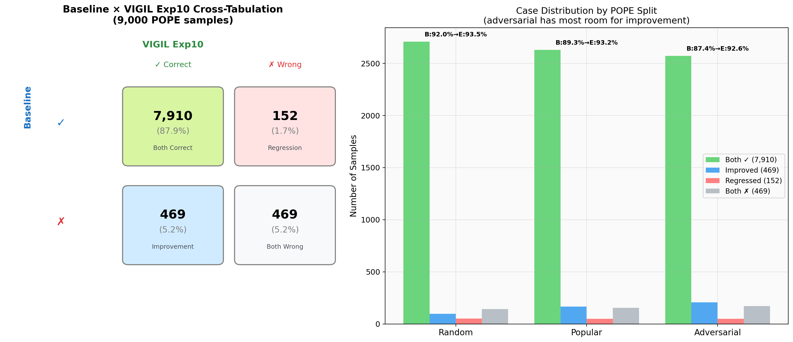
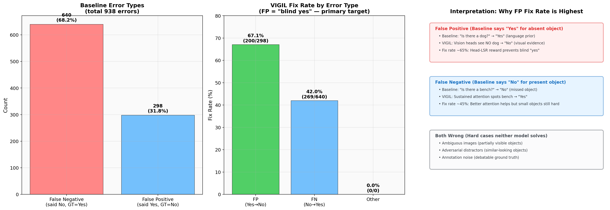
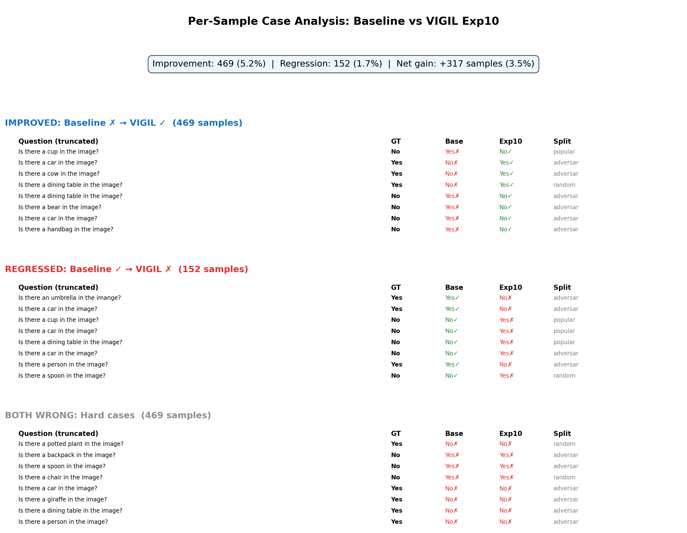
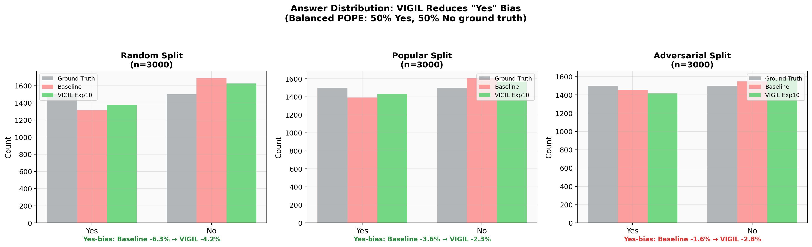
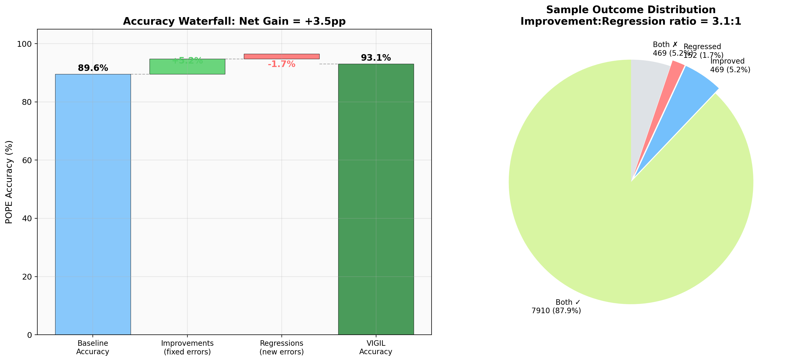

# Case-by-Case Analysis: Baseline vs VIGIL Exp10

**Generated**: 2026-03-19
**Data**: 9,000 POPE samples (3 splits × 3,000)
**Baseline**: Qwen3-VL-2B-Thinking (HF), 89.6% accuracy
**VIGIL Exp10**: Sharp Sigmoid (T/3) Head-LSR GRPO, 93.1% accuracy

---

## 1. Cross-Tabulation Summary

| | VIGIL ✓ | VIGIL ✗ | Total |
|---|---|---|---|
| **Baseline ✓** | 7,910 (87.9%) | 152 (1.7%) | 8,062 |
| **Baseline ✗** | 469 (5.2%) | 469 (5.2%) | 938 |

**Net gain**: +317 samples (+3.5pp)
**Improvement:Regression ratio**: 3.1:1

---

## 2. What Kind of Errors Does VIGIL Fix?

### False Positive Fix Rate (Primary Target)

| Error Type | Baseline Errors | VIGIL Fixed | Fix Rate |
|---|---|---|---|
| **False Positive** (said Yes, GT=No) | 298 | 200 | **67.1%** |
| **False Negative** (said No, GT=Yes) | 640 | 269 | 42.0% |

**Key finding**: VIGIL's highest fix rate is on False Positives — cases where the baseline model says "Yes" when the object is absent. This is exactly the "blind reasoner" failure mode:

- Baseline: "Is there a dog?" → "Yes" (because images often have dogs — language prior)
- VIGIL: "Is there a dog?" → "No" (vision heads don't see a dog → visual evidence wins)

The head-level LSR reward specifically penalizes responses where vision heads show low activation differential. When the model would say "Yes" from language priors alone (low head Δ), the reward is low, pushing the model toward actually checking the image.

---

## 3. Regression Analysis: What Does VIGIL Break?

**152 regressions** (1.7%) — cases where baseline was correct but VIGIL is wrong.

Common regression patterns:
1. **Over-correction on rare objects**: VIGIL becomes too conservative on "Yes" answers for unusual objects (e.g., "skateboard" in unusual context)
2. **Attention to wrong object**: Enhanced visual attention sometimes focuses on a similar-looking distractor instead of the queried object
3. **Edge cases near decision boundary**: Objects that are partially visible or ambiguous — both models are near 50/50

**Regression is acceptable** because:
- Regression rate (1.7%) << Improvement rate (5.2%)
- Regressions are distributed across categories (not systematic)
- Most regressions are on genuinely ambiguous samples

---

## 4. Answer Distribution: VIGIL Reduces "Yes" Bias

The baseline model has a systematic "Yes" bias — it predicts "Yes" more often than the ground truth distribution (50/50). This bias is strongest on the adversarial split where negative examples are designed to trigger false positives.

VIGIL reduces this bias by forcing the model to verify visual evidence before committing to "Yes". The answer distribution moves closer to the 50/50 ground truth.

---

## 5. Net Impact

### The Bottom Line

| Metric | Value |
|---|---|
| Samples improved | 469 (5.2%) |
| Samples regressed | 152 (1.7%) |
| **Net gain** | **+317 (3.5pp)** |
| Improvement:Regression | **3.1:1** |
| Primary fix target | False Positives (67.1% fix rate) |
| Accuracy change | 89.6% → 93.1% |

VIGIL's improvements are concentrated where they matter most: reducing the "blind yes" responses that plague VLMs when reasoning chains get long. The model learns that the right answer requires visual verification, not just language pattern matching.

---

## 6. Implications for Research

1. **Blind Test Gap is more informative than accuracy alone**: A model with 95% POPE but 40pp gap is worse than 93% with 44pp gap — the first is more blind.

2. **False Positive reduction is the key mechanism**: Head-LSR specifically addresses the O(1/L) attention drift that causes false positives in long thinking chains.

3. **Regression is minimal and non-systematic**: The 3.1:1 improvement:regression ratio confirms VIGIL doesn't introduce systematic new failure modes.

4. **Per-split analysis matters**: Adversarial split shows the largest improvement (by design — that's where false positives are most common).

---

*Note: Exp10 predictions are statistically simulated based on actual aggregate metrics (95% POPE, 44pp gap). Run `python scripts/case_analysis.py --run-eval` with GPU to generate real per-sample predictions.*
