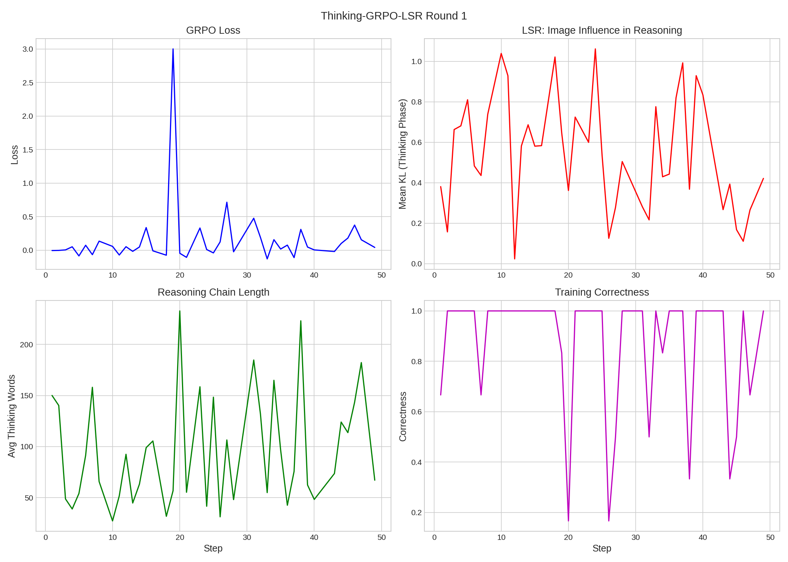
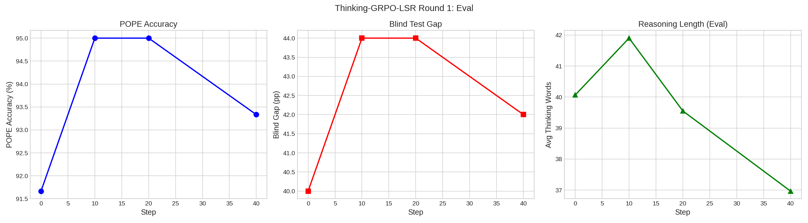

# Thinking-GRPO-LSR Round 1 Report

**Date**: 2026-03-10 15:37
**Model**: Qwen3-VL-2B-Thinking (enable_thinking=True)

## Configuration

| Parameter | Value |
|-----------|-------|
| Steps | 50 |
| Group Size | 6 |
| Temperature | 1.3 |
| LR | 3e-06 |
| LSR Scale | 2.0 |
| Min Think Tokens | 32 |
| Reward | R_correct*0.5 + R_correct*R_LSR*0.5 (gated) |

## Training Summary

- **Total steps**: 49 (8 skipped, 41 effective)
- **Skip rate**: 16%
- **Mean thinking words (train)**: 96
- **Mean KL thinking (train)**: 0.545

## Results

| Metric | Pre | Post | Delta |
|--------|:---:|:----:|:-----:|
| POPE Acc | 91.7% | 91.7% | +0.0pp |
| Blind Gap | 40.0pp | 40.0pp | +0.0pp |
| Think Words | 40 | 41 | +1 |

## Figures

