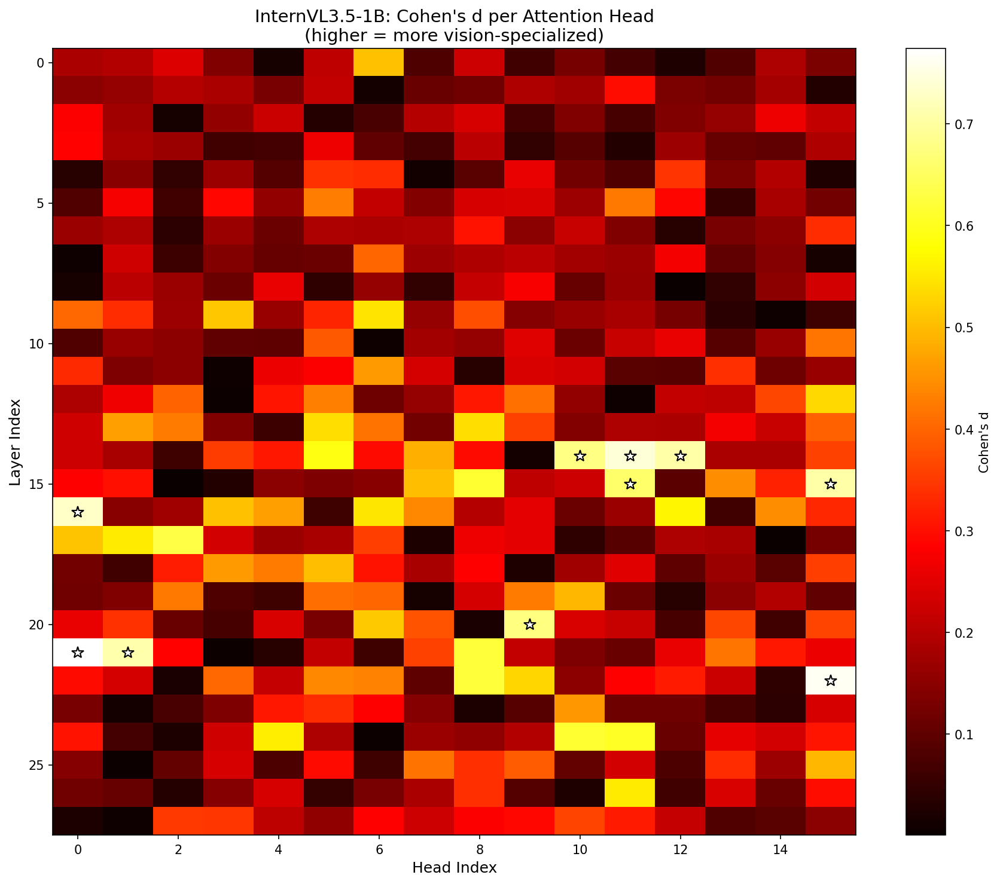
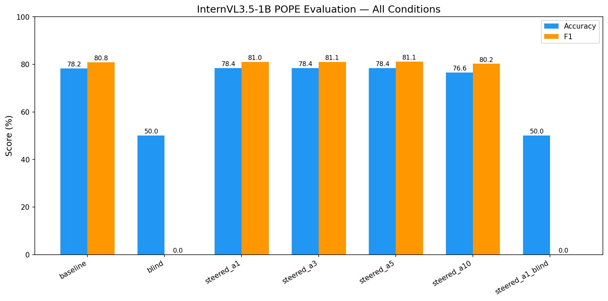

# VIGIL Multi-Model Experiment Report

**Date**: 2026-03-08
**Author**: Autonomous ML Agent

---

## Overview

VIGIL's head-level steering method was applied to InternVL3.5-1B (1B params) to test generalization beyond Qwen3-VL-2B. The pipeline includes: calibration (Cohen's d), POPE evaluation (baseline + blind), and steered inference at multiple alphas.

---

## Model Comparison

### Architecture

| | Qwen3-VL-2B | InternVL3.5-1B |
|---|---|---|
| Params | ~2B | ~1B |
| Layers | 28 | 28 |
| Q Heads | 16 | 16 |
| KV Heads | 8 (GQA) | 8 (GQA) |
| Head Dim | 128 | 128 |
| Hidden | 2048 | 1024 |

### POPE Results

| Condition | Qwen3-VL-2B | InternVL3.5-1B | Delta |
|-----------|-------------|----------------|-------|
| Baseline Acc | **87.4%** | 78.2% | -9.2pp |
| Baseline F1 | 87.2% | 80.8% | -6.4pp |
| Baseline Precision | 88.7% | 72.1% | -16.6pp |
| Baseline Recall | 85.7% | 92.0% | +6.3pp |
| Blind Acc | 50.0% | 50.0% | 0.0pp |
| Blind Gap | **37.4pp** | 28.2pp | -9.2pp |
| Steered (best α) | 88.0% (α=5) | 78.4% (α=1) | -9.6pp |
| Steered Gap | +0.6pp | +0.2pp | - |
| BoN+SFT Acc | 87.8% | N/A | - |
| BoN+SFT Precision | **90.3%** | N/A | - |

### Key Observations

1. **InternVL3.5-1B has a "Yes" bias**: Recall is very high (92.0%) but precision is low (72.1%), meaning it over-predicts "Yes". This is the opposite of an ideal anti-hallucination model.

2. **Blind test reveals strong image dependence**: Both models drop to 50% when blind (random guessing for Qwen3, always-No for InternVL). InternVL's blind behavior (always "No") is different from its normal behavior (Yes-biased), confirming it genuinely uses visual information.

3. **Steering has minimal effect on InternVL**: Only +0.2pp vs Qwen3's +0.6pp. This correlates with lower Cohen's d values (InternVL max=0.774 vs Qwen3 max=9.8).

---

## Calibration Analysis

### Qwen3-VL-2B Vision Heads
- **Two types**: Decision heads (L4-5, high d up to 9.8) + Feature heads (L24-27, high activation Δ)
- Max Cohen's d: **9.8**
- Effective steering: Yes (+0.6pp POPE, +3pp blind gap)

### InternVL3.5-1B Vision Heads
- **One type only**: Feature heads (L14-24), no early decision heads
- Max Cohen's d: **0.774** (12× lower than Qwen3)
- Top 5 heads: L21H0 (0.774), L22H15 (0.764), L14H11 (0.742), L16H0 (0.731), L21H1 (0.708)
- Effective steering: Minimal (+0.2pp)

### Hypothesis
The absence of early decision heads in InternVL suggests that InternVL processes visual information differently — distributing it across more heads with smaller per-head contribution. This makes head-level steering less effective because there are no "bottleneck" heads to amplify.

---

## Steering Alpha Sweep

| Alpha | Acc | F1 | Precision | Recall |
|-------|-----|-----|-----------|--------|
| 0 (baseline) | 78.2% | 80.8% | 72.1% | 92.0% |
| 1 | **78.4%** | **81.0%** | **72.3%** | 92.0% |
| 3 | 78.4% | 81.1% | 72.2% | 92.4% |
| 5 | 78.4% | 81.1% | 72.0% | 92.8% |
| 10 | 76.6% | 80.2% | 69.5% | 94.8% |

- Steering at α=1-5 gives marginal improvement (+0.2pp)
- α=10 hurts accuracy (-1.6pp) — over-amplification pushes model to always say "Yes" (recall 94.8% but precision drops to 69.5%)
- Sweet spot is α=1 for InternVL (vs α=3-5 for Qwen3)

---

## Implications for VIGIL

### What Transfers
- Calibration pipeline (Cohen's d profiling) works across architectures
- Blind test protocol works identically
- POPE evaluation is model-agnostic

### What Doesn't Transfer
- Steering hyperparameters (α=5 optimal for Qwen3, α=1 for InternVL)
- Head type distribution (Qwen3 has decision+feature heads, InternVL only feature)
- Magnitude of steering benefit (Qwen3: +0.6pp, InternVL: +0.2pp)

### Recommendations
1. **BoN+SFT should be tested on InternVL** — it was the most effective method for Qwen3 and doesn't depend on head structure
2. **InternVL may benefit from different steering targets** — instead of o_proj, try attention weight scaling or value-head steering
3. **Cohen's d threshold for "steer-ability"**: Models with max d < 1.0 may not benefit from head-level steering

---

## Technical Notes

### InternVL3.5-1B Loading Issues (Transformers 5.0)
1. **Meta tensor bug**: InternVL's `modeling_intern_vit.py` uses `torch.linspace().item()` which fails with meta tensors. Fixed by patching to pure Python list comprehension.
2. **Missing `all_tied_weights_keys`**: Transformers 5.0 requires this property. Added via monkey-patch.
3. **`torch_dtype` deprecation**: Use `dtype` instead (warning only).

### Files
| File | Description |
|------|-------------|
| `scripts/eval_internvl.py` | InternVL baseline + blind eval |
| `scripts/calibrate_internvl.py` | InternVL calibration (Cohen's d) |
| `scripts/eval_internvl_steered.py` | Steered eval + visualization |
| `checkpoints/calibration/internvl3_5_1b/calibration.json` | Calibration data |
| `lab/reports/multimodel/internvl3_5_1b/` | Results + plots |
