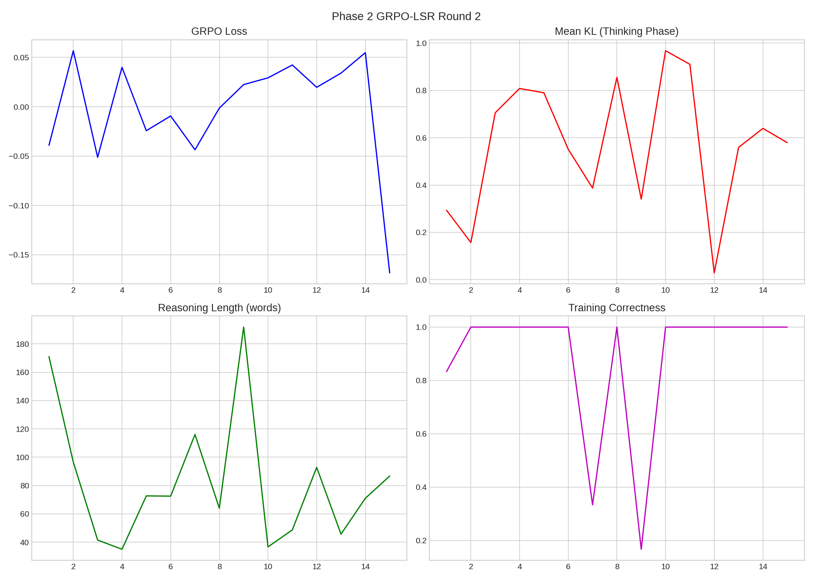
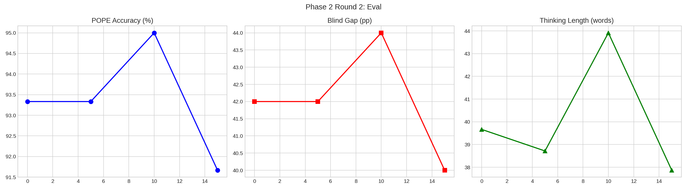

# Phase 2 GRPO-LSR Round 2

**Date**: 2026-03-10 18:23
**Model**: Qwen3-VL-2B-Thinking (Unsloth full fine-tune, NO LoRA)

## Config
| Param | Value |
|-------|-------|
| Steps | 15 |
| Group | 6 |
| T | 1.3 |
| LR | 2e-06 |
| Reward | R_correct*0.5 + R_correct*R_LSR*0.5 (gated) |

## Results
| Metric | Pre | Post | Δ |
|--------|:---:|:----:|:-:|
| POPE | 93.3% | 91.7% | -1.7pp |
| Gap | 42.0pp | 40.0pp | -2.0pp |
| Think | 40w | 38w | — |
| Skip Rate | 0/15 (0%) | — | — |

