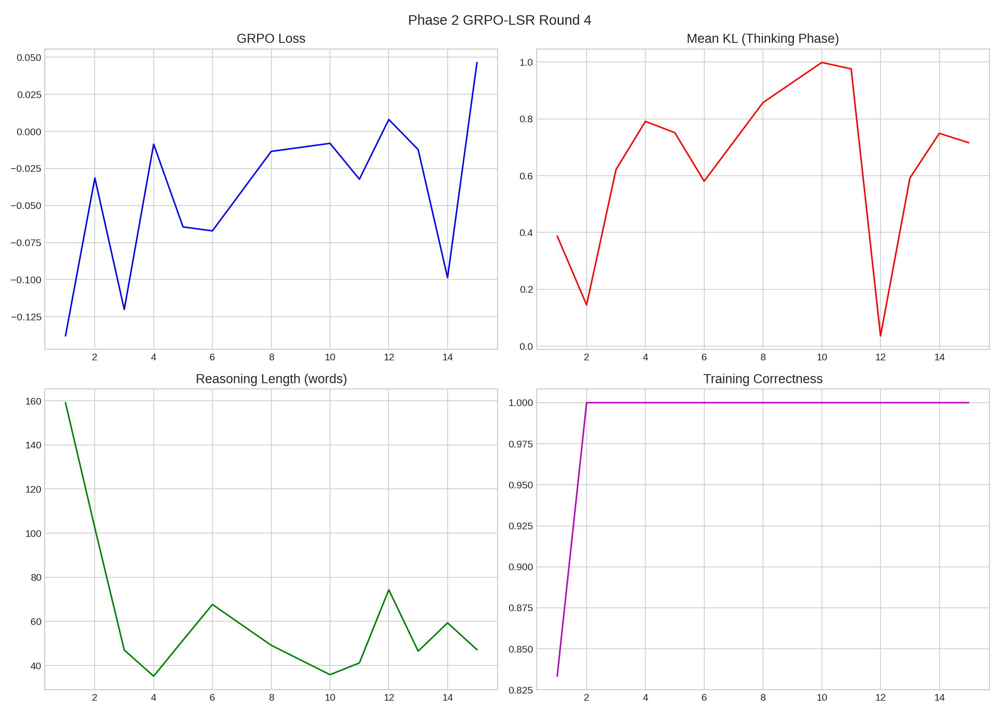
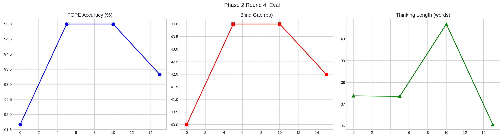

# Phase 2 GRPO-LSR Round 4

**Date**: 2026-03-10 20:00
**Model**: Qwen3-VL-2B-Thinking (Unsloth full fine-tune, NO LoRA)

## Config
| Param | Value |
|-------|-------|
| Steps | 15 |
| Group | 6 |
| T | 1.3 |
| LR | 2e-06 |
| Reward | R_correct*0.5 + R_correct*R_LSR*0.5 (gated) |

## Results
| Metric | Pre | Post | Δ |
|--------|:---:|:----:|:-:|
| POPE | 91.7% | 93.3% | +1.7pp |
| Gap | 40.0pp | 42.0pp | +2.0pp |
| Think | 37w | 36w | — |
| Skip Rate | 2/15 (13%) | — | — |

