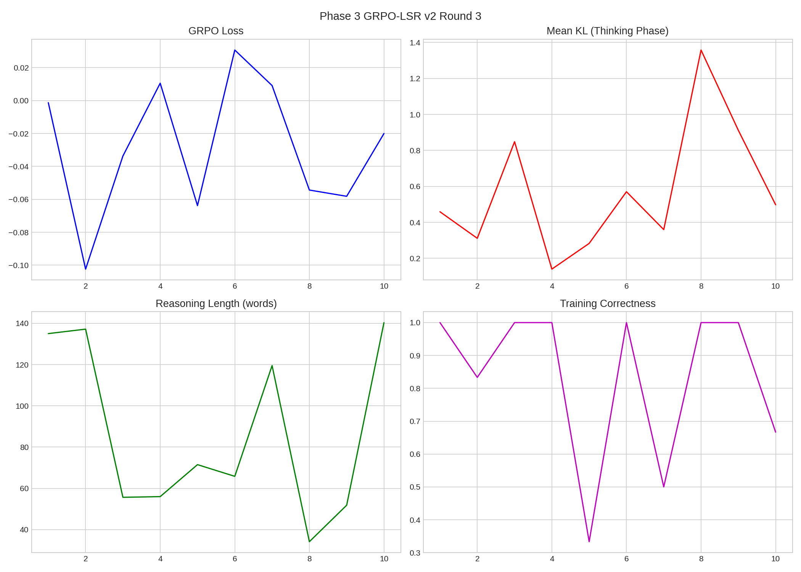
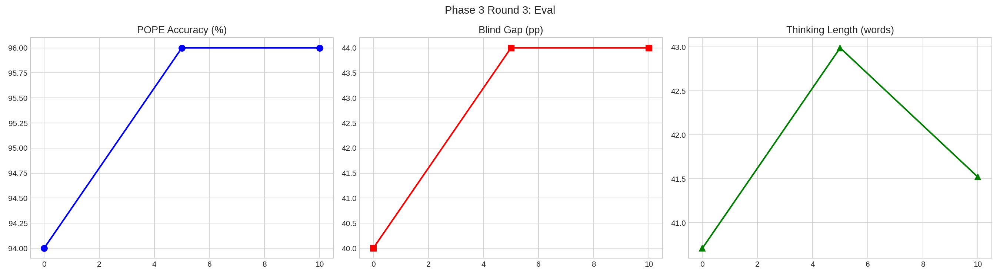

# Phase 3 GRPO-LSR v2 Round 3

**Date**: 2026-03-11 02:47
**Improvements**: Expanded data, adaptive LSR, curriculum reward, 10 steps

## Config
| Param | Value |
|-------|-------|
| Steps | 10 |
| Group | 6 |
| T | 1.3 |
| LR | 2e-06 |
| Reward | Curriculum: w_correct=0.6→0.4, w_lsr=0.4→0.6 (gated) |
| Data | 2000 samples (A-OKVQA + TextVQA + GQA) |

## Results
| Metric | Pre | Post | Delta |
|--------|:---:|:----:|:-----:|
| POPE | 94.0% | 96.0% | +2.0pp |
| Gap | 40.0pp | 44.0pp | +4.0pp |
| Think | 41w | 42w | — |

