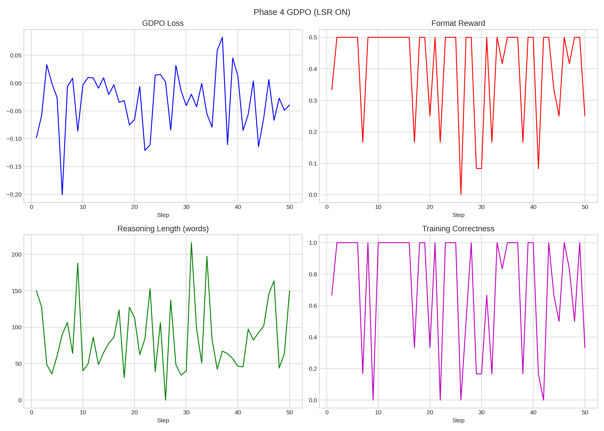
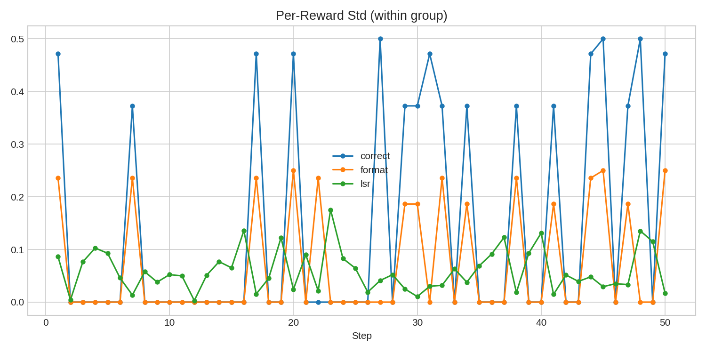
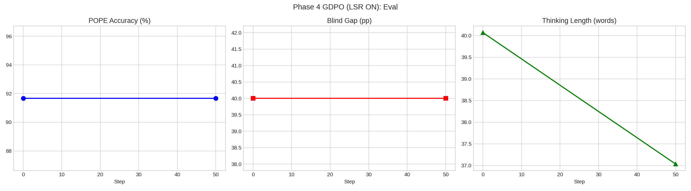

# Phase 4 GDPO (LSR ON)

**Date**: 2026-03-13 17:52
**Model**: Qwen3-VL-2B-Thinking (full fine-tune)
**Base**: Qwen/Qwen3-VL-2B-Thinking
**Method**: GDPO (arXiv:2601.05242) -- decoupled per-reward normalization

## Config
| Param | Value |
|-------|-------|
| Steps | 50 |
| Group | 6 |
| T | 1.3 |
| LR | 2e-06 |
| Rewards | correct=0.4, format=0.2, LSR=0.4 |

## GDPO vs GRPO
| Aspect | GRPO | GDPO |
|--------|------|------|
| Normalization | combine rewards -> normalize | normalize each -> combine -> normalize |
| Signal preservation | LSR washed out by R_correct | Each reward preserved independently |

## Results
| Metric | Pre | Post | Delta |
|--------|:---:|:----:|:-----:|
| POPE | 91.7% | 91.7% | +0.0pp |
| Gap | 40.0pp | 40.0pp | +0.0pp |
| Think | 40w | 37w | -- |
| Skip rate | 0/50 (0%) | -- | -- |

