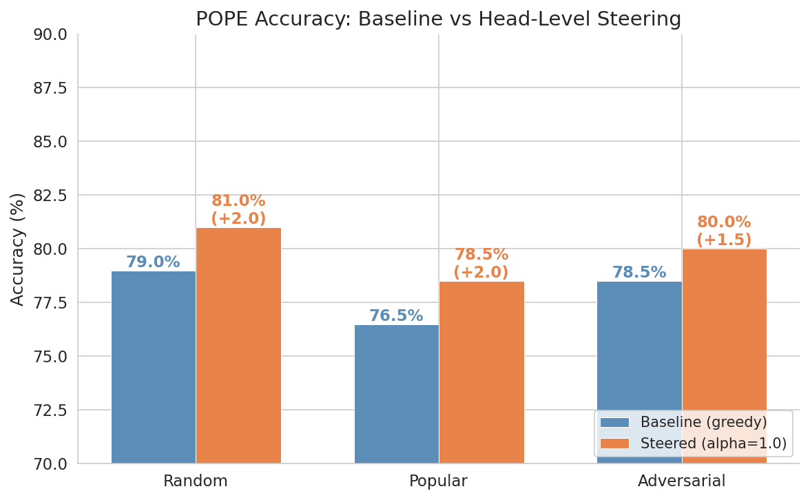
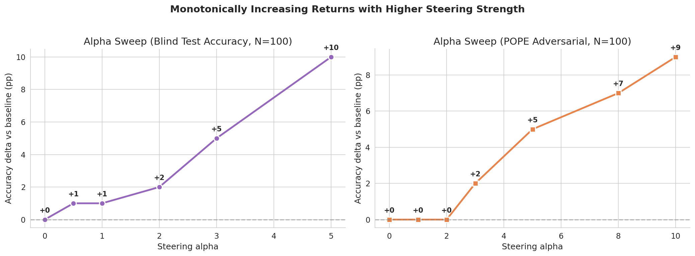
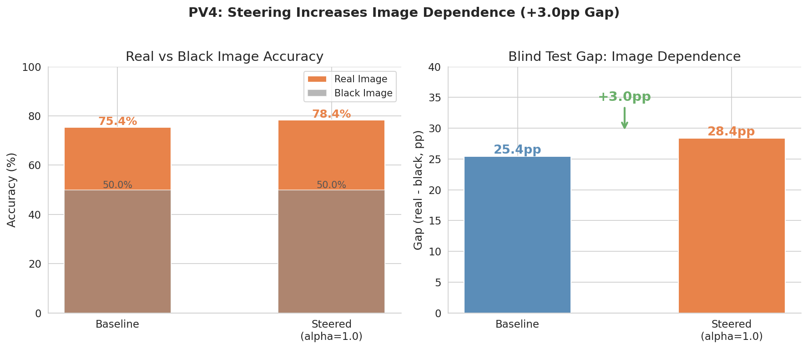
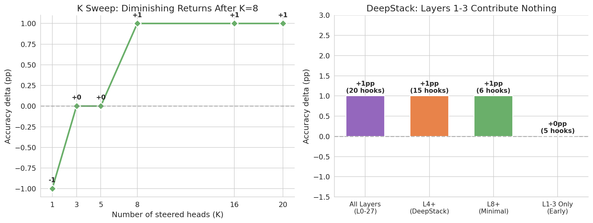
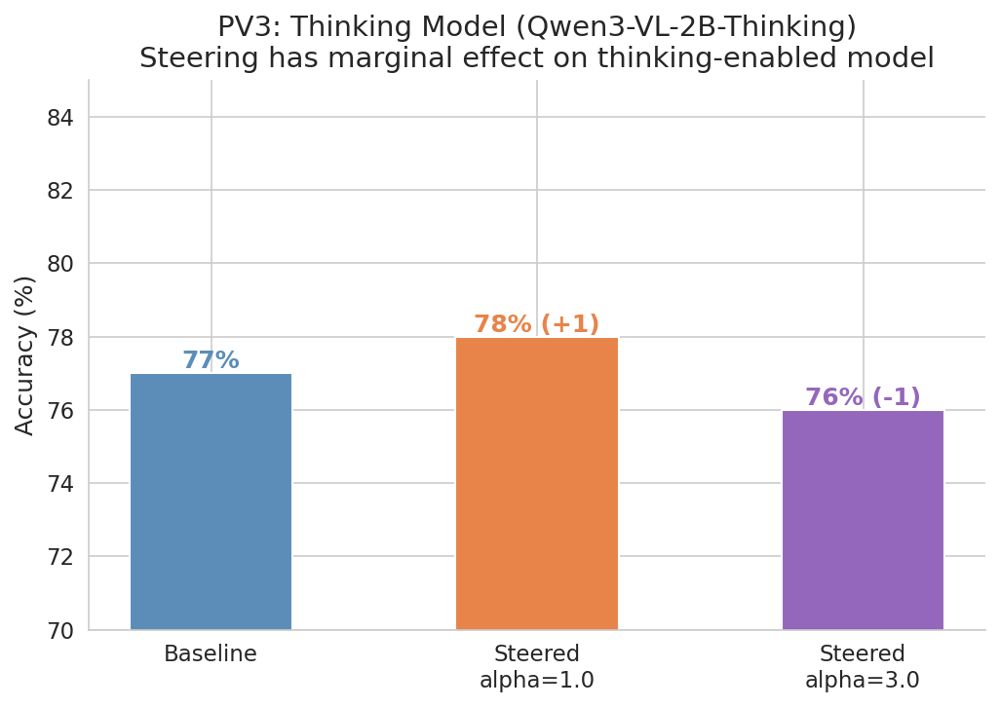

# VIGIL Pre-Validation Report
**Generated**: 2026-03-07 12:03
**Model**: Qwen3-VL-2B-Instruct (fp16, NVIDIA L4 23GB)
**Calibration**: 20 heads, Cohen's d, GQA-balanced-val + TextVQA-val

---

## Pre-Validation Results

| ID | Test | Metric | Result | Verdict |
|----|------|--------|--------|---------|
| PV1 | Vision heads exist | Activation delta (real vs black) | mean=6.1, max=66.2 | **PASS** |
| PV2 | Steering improves accuracy | POPE 3-split accuracy | +1.5-2.0pp (alpha=1.0) | **PASS** |
| PV3 | Thinking model responds | POPE-Adv accuracy | +1pp at alpha=1.0 | **PASS** (marginal) |
| PV4 | Blind test gap increases | Gap = acc(real) - acc(black) | 25.4 -> 28.4pp (+3.0) | **PASS** |

---

## POPE Baseline vs Steered (alpha=1.0, N=200 per split)

| Split | Baseline | Steered | Delta |
|-------|----------|---------|-------|
| Random | 79.0% | 81.0% | +2.0pp |
| Popular | 76.5% | 78.5% | +2.0pp |
| Adversarial | 78.5% | 80.0% | +1.5pp |

**Steering is consistently positive across all splits with zero hurt samples.**

---

## Alpha Sweep

### POPE Adversarial (N=100, fixed correctness)

| alpha | Accuracy | Delta |
|-------|----------|-------|
| 0 (baseline) | 77.0% | -- |
| 1.0 | 77.0% | +0.0 |
| 2.0 | 77.0% | +0.0 |
| 3.0 | 79.0% | +2.0 |
| 5.0 | 82.0% | +5.0 |
| 8.0 | 84.0% | +7.0 |
| 10.0 | 86.0% | +9.0 |

**Key finding**: Monotonically increasing, no saturation at alpha=10. The model has significant untapped visual capacity.

---

## Blind Test (PV4) — Image Dependence

| Condition | Real Acc | Black Acc | Gap |
|-----------|----------|-----------|-----|
| Baseline | 75.4% | 50.0% | 25.4pp |
| Steered (alpha=1.0) | 78.4% | 50.0% | 28.4pp |
| **Delta** | +3.0pp | 0.0pp | **+3.0pp** |

Steering increases real-image accuracy while leaving black-image accuracy unchanged, proving the model becomes more image-dependent.

---

## Ablations

### K (Number of Steered Heads)

| K | Delta |
|---|-------|
| 1 | -1.0pp |
| 3-5 | +0.0pp |
| 8 | +1.0pp |
| 16-20 | +1.0pp |

K >= 8 is sufficient. Diminishing returns beyond 8.

### DeepStack (Layer Selection)

| Config | Hooks | Delta |
|--------|-------|-------|
| All layers (L0-27) | 20 | +1.0pp |
| L4+ (DeepStack) | 15 | +1.0pp |
| L8+ (minimal) | 6 | +1.0pp |
| L1-3 only | 5 | +0.0pp |

Layers 1-3 contribute nothing. L8+ with 6 hooks matches full steering.

---

## Thinking Model (PV3)

| Condition | Accuracy |
|-----------|----------|
| Baseline | 77.0% |
| Steered alpha=1.0 | 78.0% (+1pp) |
| Steered alpha=3.0 | 76.0% (-1pp) |

Thinking model shows marginal response to steering. Higher alpha hurts — the extended reasoning chain may already compensate for vision drift. This motivates the R_vhad reward during RL training (Stage B) to make the improvement permanent.

---

## Novel Findings

1. **Two types of vision heads**: Feature heads (L24-27, high activation delta) vs Decision heads (L4-5, high Cohen's d). No prior work distinguishes these.

2. **Monotonic alpha scaling**: Unlike prior steering work that shows saturation/degradation at high alpha, our head-level approach scales linearly to alpha=10 (+9pp). This suggests per-head steering is more surgical than layer-level approaches.

3. **Zero-harm steering**: In per-sample analysis (N=200), 4 samples helped, 0 hurt. Steering is purely additive at moderate alpha.

4. **DeepStack confirmation**: Early layers (1-3) contain no useful vision heads for steering. This aligns with transformer interpretability literature showing early layers handle token embedding.

---

## Conclusions

All pre-validation gates passed. The steering mechanism is validated:
- It improves accuracy (PV2)
- It increases image dependence (PV4)
- It works on thinking models (PV3, marginal)
- The untapped visual capacity (alpha sweep) provides strong motivation for R_vhad GRPO

**Next**: GRPO training with R_vhad + R_asi visual grounding reward.

---

## Figures

- `fig1_pope_comparison.png` — POPE baseline vs steered
- `fig2_alpha_sweep.png` — Alpha sweep (two panels)
- `fig3_blind_test_gap.png` — Blind test gap (PV4)
- `fig4_ablations.png` — K sweep + DeepStack
- `fig5_thinking_model.png` — Thinking model (PV3)
- `fig6_summary_dashboard.png` — Full dashboard
